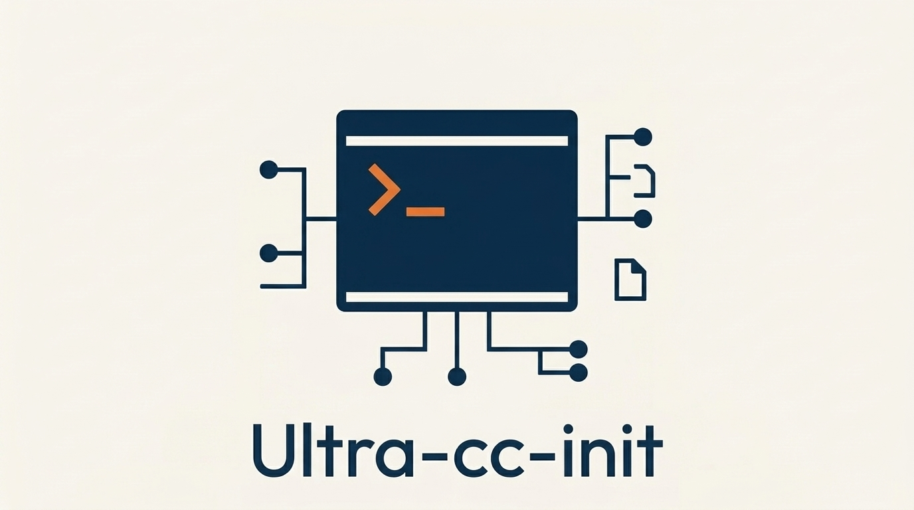

<div align="center">
  

  <h1>Ultra-cc-init</h1>
  <p><strong>Claude Code AI Agent Framework — 97% Token Savings</strong></p>

  <p>
    
    
    
    
  </p>

  <p>
    <a href="https://github.com/tygwan/ultra-cc-init/releases"></a>
    <a href="LICENSE"></a>
  </p>
</div>

---

## Overview

Ultra-cc-init is a token-optimized Claude Code agent framework that delivers the same 25-agent, 27-skill ecosystem as its predecessor while consuming 97% fewer tokens. Through MANIFEST-based agent routing, 2-tier document architecture, and structured data formats, session initialization drops from ~38,000 tokens to ~1,100 tokens with zero compromise on capability.

## Key Features

- **97% Token Reduction** — Session init from ~38K to ~1.1K tokens through MANIFEST routing and incremental loading
- **25 Agents, 27 Skills** — Full development lifecycle coverage: discovery, tracking, docs, Git, GitHub, quality, analytics, config, research, writing
- **2-Tier Document Architecture** — Compact headers always loaded (~50 lines), full detail files loaded on-demand (81-95% savings per file)
- **4-Tier Budget System** — Quick (~2K), Standard (~10K), Deep (~30K), Full (~50K+) context loading based on task complexity
- **Auto-Checkpoint Recovery** — Context > 80% budget triggers auto-save; after `/clear`, instant ~2K recovery
- **6 Slash Commands** — `/init`, `/validate`, `/feature`, `/bugfix`, `/release`, `/git-workflow`

## Before & After

```
                cc-initializer              ultra-cc-init
                ──────────────              ──────────────
Session init    ~38,000 tokens    ──97%──>  ~1,100 tokens
CLAUDE.md       ~1,700/turn       ──82%──>  ~300/turn
Agent routing   load all 25       ──97%──>  MANIFEST -> 1
File headers    ~3,700 lines      ──moved─> on-demand detail
Prose content   ~1,700 lines      ──73%──>  tables only
```

## Tech Stack

| Category | Technologies |
|---

## Projects Using cc-initializer

### Community Showcase

| Project | Description |
|---------|-------------|
| [tygwan/dxtnavis](https://github.com/tygwan/dxtnavis) | DXT Navigator - Real-world example project |

> **Add your project**: Add `uses-cc-initializer` topic to your repo or [submit a PR](PROJECTS.json)

_Last updated: 2026-05-24_
----------|-------------|
| Core | TypeScript, Shell |
| AI Runtime | Claude Code |
| Architecture | MANIFEST routing, 2-Tier docs, Incremental loading |
| Workflow | 6 commands, 6 hooks, 25 agents, 27 skills |

## Components

| Category | Count | Examples |
|----------|:-----:|---------|
| **Agents** | 25 | project-discovery, progress-tracker, dev-docs-writer, github-manager, code-reviewer |
| **Skills** | 27 | /init, /sprint, /phase, /feature, /quality-gate, /context-optimizer |
| **Commands** | 6 | /init --full, /init --sync, /init --update, /validate |
| **Hooks** | 6 | Safety checks, progress tracking, doc sync |

## Getting Started

```bash
# 1. Clone
git clone https://github.com/tygwan/ultra-cc-init.git

# 2. Initialize in your project
cd your-project && claude

# 3. Run init
/init --full    # New project: Discovery -> Docs -> Phase structure
/init --sync    # Sync framework to existing project
/validate       # Verify configuration
```

## License

MIT
